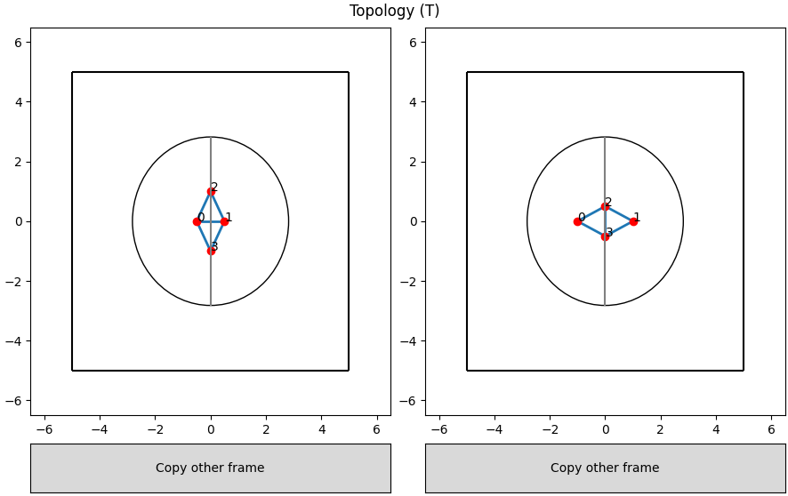

# Texture
A Python package to compute quantify, from a set of points and links between them, a texture and its time evolution.

Implementation of F. Graner, B. Dollet, C. Raufaste, and P. Marmottant, ***Di**screte **r**earranging **di**sordered **p**atterns, part I: Robust statistical tools in two or three dimensions* **Eur. Phys. J. E** 25, 349-369 (2008) DOI [10.1140/epje/i2007-10298-8](https://doi.org/10.1140/epje/i2007-10298-8)

## Installation
```bash
pip install -e "git+https://github.com/marcos1561/texture.git/#egg=texture"
```

## Calculators
One can use core functions (such as `bin_texture_sum()`) to calculate tools, but this is not convenient. To provide
a better user interface, calculators are provided inside the module `texture.calculators`.

### FramesArray Calculator
If you have a list of frames (a frame is a list of points) and want to do an average between all frames, `FramesArray` is the
calculator for you. In the following example, all tools are calculated for a list of frames (doing an average for all frames), 
for every grid element of the grid created, and the resulting texture is shown. 
```python
import matplotlib.pyplot as plt
import grids
from texture import calculators, links, display

# suppose i've loaded frames1 and frames2 here

grid = grids.RegularGrid(
    length=10, height=10,
    num_cols=5, num_rows=5,
)

calc = calculators.FramesArray(
    frames1, frames2, grid, 
    links.VoronoiLink(),
    dt=0.01,
)
r = calc.calculate()

display.draw_matrices(plt.gca(), calc.grid, r.M)
plt.show()
```

## Playground
The playground is an application to play with the texture and its derivatives in an interactive way. It consists
of two frames, where the user can add points clicking with the mouse, or move existing points also with the mouse. At each frame,
links will be calculated on the fly and the respective selected quantity (M, B or T) will be shown on the frame as an ellipse.

The fallowing example initializes the playground with some points in both frames, configured to show the topological derivative:

```python
from texture import playground

app = playground.PlayGround(
    init_points_1=[
        [-0.5, 0],
        [0.5, 0],
        [0, 1],
        [0, -1],
    ],
    init_points_2=[
        [-1, 0],
        [1, 0],
        [0, 0.5],
        [0, -0.5],
    ],
    matrix_type=playground.MatrixType.topology,
    show_uids=True,
)
app.run()
```

After running this code, you should see the following


